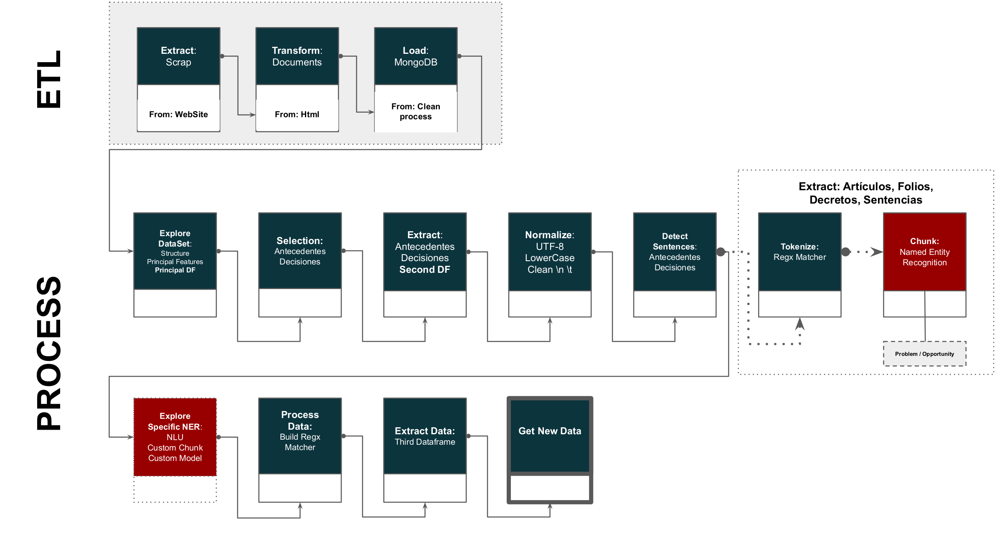

# Proyecto

# Pipeline data process



### About Data Base:

### Query to filter Tutelas

```json

db.judgemnts.aggregate( [
   {$count: "myCount"},
   {$match: { "sentence_id": /^T/i }}
])


db.judgemnts.aggregate( [
   {$match: { "sentence_id": /^T/i }}
])

db.judgemnts.count({ "sentence_id": /^T/i })

db.judgemnts.find({ "sentence_id": /^T/i })


db.judgemnts.aggregate( [
   {
        $group: {
            "sentence_id": /^T/i,
             count: { $sum: 1 }
        }
   }
])


db.judgemnts.aggregate( [
   {
        $group: {
           _id: "$sentence_id",
           judgemnts: { $push: "$date" }
        }
   }
])


db.judgemnts.aggregate( [

   {
         $match: { "sentence_id": /^T/i }
   },
   {
        $group: {
           _id: "$sentence_id",
           count: { $sum: 1 }
        }
   }
])

```

### Dataset
* Initial: (8126, 12)
```
_id                                       corteconstitucional_T-017/12
file_id                                                      T-3140852
date                                          2012-01-20T00:00:00.000Z
sentence_id                                                   T-017/12
topic                Estabilidad laboral reforzada, debido proceso,...
report_receipt_at                                           2012-08-08
text                 REPÚBLICA DE COLOMBIA\n\n\nSentencia T-017/12\...
url                  https://www.corteconstitucional.gov.co/relator...
judicature           [{"name":"MARÍA VICTORIA CALLE CORREA","rol":"...
participants         [{"name":"ANA JULIA GARZON GUERRERO","role":"P...
vocabulary           [{"text":"república","qty":3},{"text":"colombi...
collective           [{"text":"república","label":"MISC","qty":1},{...
```

* Result: (3691, 12)
```
file_id                                                      T-3140852
sentence_id                                                   T-017/12
text                 REPÚBLICA DE COLOMBIA\n\n\nSentencia T-017/12\...
```

### General Dataset statistics

### data set Final
```
sentence_id                                                     T-035/12
antecedentes           antecedentes \n \n1.1.         \r\nexpediente ...
decision               decision \n \nen merito de lo expuesto, la\r\n...
decision_corta         decision \n \nen merito de lo expuesto, la\r\n...
referencias             comuniquese,\r\npubliquese en la gaceta de la...
decision_corta_norm    decision merito expuesto sala septima revision...
antecedentes_norm      antecedentes expediente solicitud walter franc...
text                   REPÚBLICA DE COLOMBIA\n\n\nSentencia T-035/12\...
norm_text              republica colombia sentencia t03512 proteccion...
articulos              [articulos 86 y 241 numeral 9° de la constituc...
folios                 [folio 11  cuaderno no 2 ), folios 12-14  cuad...
decretos               [decreto 4433/04 se consagra la pension de inv...
sentencias             [sentencia t-035/12 proteccion constitucional ...
```

### General Dataset statistics

* Number of variables	9
* Number of observations	1862
* Missing cells	0
* Missing cells (%)	0.0%
* Duplicate rows	0
* Duplicate rows (%)	0.0%
* Total size in memory	131.0 KiB
* Average record size in memory	72.1 B

## ===================

#### Variable types

* Categorical	3
* Numeric	6
